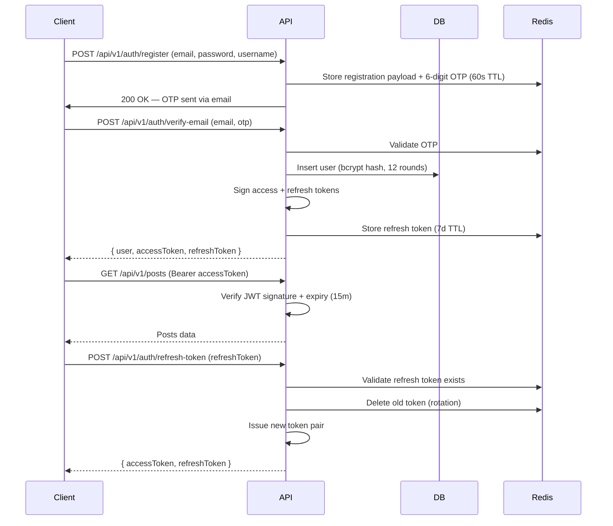
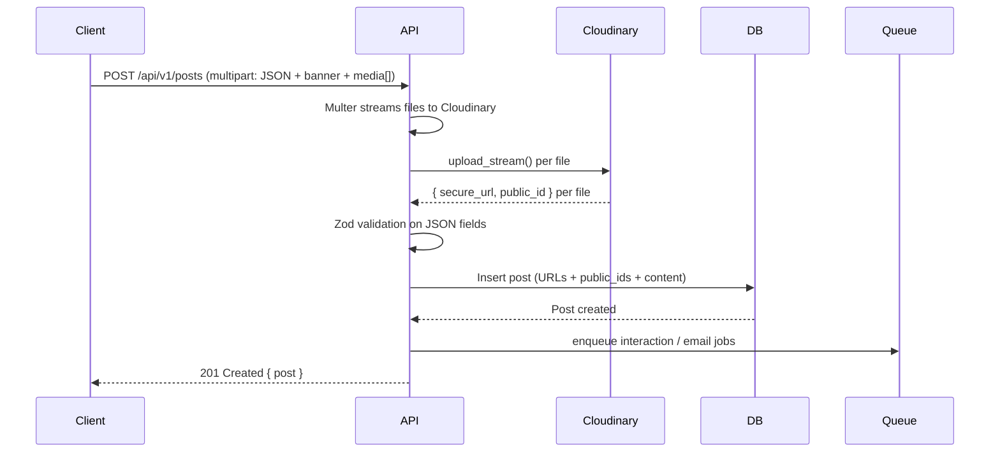

# WriteSpace Developer Guide

> Architecture, patterns, and workflows for contributors and maintainers.

## 📋 Table of Contents
- [🧠 Architecture Philosophy](#-architecture-philosophy)
- [📁 Module Structure](#-module-structure)
- [🔄 Core Flows](#-core-flows)
- [🗄️ Database Design](#️-database-design)
- [🔐 Security Practices](#-security-practices)
- [🚦 Error Handling](#-error-handling)
- [📈 Performance Optimizations](#-performance-optimizations)
- [🧩 Adding a New Feature](#-adding-a-new-feature)
- [🧪 Testing Strategy](#-testing-strategy)
- [🐳 Local Development](#-local-development)
- [🔧 Troubleshooting](#-troubleshooting)

## 🧠 Architecture Philosophy

WriteSpace is built with three organizing principles:

**1. Vertical slicing** — every feature owns its controller, service, routes, DTOs, and interfaces. No cross-module imports; if `posts` needs something from `users`, it goes through the DB schema, not the module.

**2. Two service styles, one rule.** Small stateless services use `static` methods (`AuthService`, `UserService`). Services that need to hold onto config or queue handles are exported as singletons (`postService`, `interactionsService`, `notificationService`). Pick the style that matches the service's state needs — don't mix styles within one service.

**3. Fail fast at the edge.** Zod schemas validate every request body, query param, and route param in middleware *before* the controller runs. Controllers receive typed, validated input and never re-validate.

```text
src/
├── modules/             # Features (auth, posts, users, interactions, notification)
│   └── [feature]/
│       ├── dtos/        # Zod schemas + inferred types
│       ├── interface/   # TypeScript interfaces (JWT payload, OAuth profile, etc.)
│       ├── [feature].controller.ts
│       ├── [feature].service.ts
│       └── [feature].routes.ts
├── shared/              # Cross-cutting concerns
│   ├── middlewares/
│   ├── queues/          # BullMQ queues + workers
│   ├── infra/           # External services (mailer)
│   ├── types/           # Express augmentation, shared types
│   └── utils/           # ApiResponse, AppError, og-generator
└── db/                  # Drizzle schema + connection pool
```

## 📁 Module Structure 
Every module follows the same layout. Example from `modules/users/`:  

```typescript
// modules/users/user.service.ts
export class UserService {
  public static async getMe(userId: string): Promise<PublicUser> {
    const user = await db.query.users.findFirst({
      where: eq(users.id, userId),
    });
    if (!user) throw new AppError(HTTP_STATUS.NOT_FOUND, "User session invalid");
    return this.toPublicUser(user);
  }
}

// modules/users/user.controller.ts
export class UserController {
  public static async getMe(req: Request, res: Response, next: NextFunction): Promise<void> {
    try {
      if (!req.user?.id) throw new AppError(HTTP_STATUS.UNAUTHORIZED, "Session expired");
      const userRecord = await UserService.getMe(req.user.id);
      new ApiResponse(res, HTTP_STATUS.OK, "Current user record retrieved", userRecord).send();
    } catch (error) {
      next(error);  // Global error middleware handles the rest
    }
  }
}

// modules/users/user.routes.ts
const router = Router();
router.get("/me", authenticate, UserController.getMe);
export const userRoutes = router;
```   

**The pattern:**  

- **Controller** — HTTP concerns only. Reads `req`, calls the service, wraps the result in `ApiResponse`, forwards errors via `next(error)`. No business logic.  
- **Service** — All business logic. Talks to the DB, Redis, queues, external services. Throws `AppError` on failure. Never touches req or res.  
- **Routes** — Wires middleware and controller together. `upload.fields(...)` for multipart, `validate(schema)` for Zod, `authenticate` for auth.  
- **DTOs** — Zod schemas. The inferred TypeScript type is what controllers and services use.  


## 🔄 Core Flows

### Authentication Flow


**Implementation details:**
-  Access token: JWT signed with `JWT_ACCESS_SECRET`, contains `{ id, role }`, 15m expiry
-  Refresh token: also a JWT, signed with `JWT_REFRESH_SECRET`, 7d expiry, stored in Redis under `refresh_token:{userId}:{token}`. **Rotated on every refresh** — old token is deleted.
-  OAuth2: Passport.js strategies for Google and GitHub. First-time OAuth users get a random password hash; subsequent logins reuse the same account.
-  Password reset: 32-char token stored in Redis (1h TTL). On reset, **all** refresh tokens for that user are invalidated via `redis.scanIterator`.

### Post Creation Flow (with Cloudinary)  


**Key files:**  

-  `shared/middlewares/upload.middleware.ts` — custom `CloudinaryStorageEngine` implementing Multer's `StorageEngine`. Streams each file to Cloudinary, attaches `location` (secure URL), `public_id`, `key`, and `secure_url` to `req.file(s)`.
-  `shared/types/cloudinary-file.ts` — `CloudinaryFile`, `CloudinaryFilesMap` types used across controllers.
-  `modules/posts/posts.service.ts` — `createPost()` writes both `media` (URLs) and `mediaPublicIds` (IDs). Deletion needs the IDs.  

**Limits:** 5 MB per file, 12 files per request (1 banner + 10 media + buffer), configured via `MAX_FILE_SIZE_MB` and `MAX_FILES_PER_UPLOAD` env vars.  

### Media Cleanup Flow  

When a post is deleted, its Cloudinary assets are queued for cleanup:  

```typescript
// posts.service.ts::deletePost()
const publicIdsToDelete: string[] = [];
if (post.coverImagePublicId) publicIdsToDelete.push(post.coverImagePublicId);
if (post.mediaPublicIds?.length) publicIdsToDelete.push(...post.mediaPublicIds);
await addMediaCleanupJob(publicIdsToDelete);
```  

The worker (`shared/queues/media.worker.ts`) calls `cloudinary.uploader.destroy(publicId)` for each. It guards against URLs accidentally passed as IDs and rethrows on failure so BullMQ applies exponential backoff.  


### Notification Flow (Async)

Three queues, each with its own worker file:

| Queue | Producer | Worker | Purpose |
|-------|----------|--------|---------|
| `email` | `notificationService.send*Email()` | `email.worker.ts` | SMTP sends via Nodemailer |
| `interaction` | `addInteractionJob()` from `posts/interactions` | `interaction.worker.ts` | In-app notifications on like/comment/follow |
| `media-cleanup` | `addMediaCleanupJob()` from `posts/users` | `media.worker.ts` | Cloudinary destroy calls |

All three workers are instantiated at `server.ts` import time and gracefully closed on `SIGTERM`/`SIGINT`.  

```typescript
// shared/queues/media.worker.ts
export const mediaWorker = new Worker(
  "media-cleanup",
  async (job: Job<MediaCleanupJobData>) => {
    const { publicIds } = job.data;
    for (const publicId of publicIds) {
      if (!publicId || publicId.startsWith("http")) continue;
      await cloudinary.uploader.destroy(publicId);
    }
  },
  { connection: redisConnectionOptions },
);
```

## 🗄️ Database Design  

PostgreSQL via Drizzle ORM. All primary entities use UUIDs; junction tables use composite primary keys.  

| Table | Purpose | Key Fields |
|-------|---------|------------|
| `users` | Accounts, profiles, social links, stats | `id` (uuid), `email`, `username`, `passwordHash`, `role`, `status` |
| `posts` | Blog posts with cover + media | `id` (uuid), `title`, `slug`, `content`, `coverImageUrl`, `coverImagePublicId`, `mediaPublicIds`, `authorId`, `status` |
| `comments` | Threaded comments | `id` (uuid), `content`, `postId`, `authorId`, `parentCommentId` |
| `likes` | Post likes | `userId`, `postId` (composite PK) |
| `comment_likes` | Comment likes | `commentId`, `userId` (composite PK) |
| `shares` | Share events per platform | `id` (uuid), `userId`, `postId`, `platform` |
| `notifications` | In-app alerts | `id` (uuid), `recipientId`, `actorId`, `type`, `isRead` |
| `follows` | Follower graph | `followerId`, `followingId` (composite PK) | 

### Key Design Decisions  

- UUID primary keys — `uuid().defaultRandom()`, distributed-friendly. Junction tables use composite PKs to enforce uniqueness at the DB level.

- Soft delete via status enum — `posts.status` is `draft | scheduled | published | archived | trash`. `users.status` is `active | suspended | banned`. No `deleted_at` column; the enum is the source of truth.

- Separate like tables, not polymorphic — `likes` for posts, `comment_likes` for comments. The old README mentioned a polymorphic `target_type` column; that doesn't exist. Two tables with foreign keys are simpler and faster.

- Content stored as text — not JSON. Post bodies are sanitized HTML (`sanitize-html` with an allow-list) before insert.

- Indexes — `posts_status_publish_date_idx` on `(status, publishDate)`, `posts_author_idx` on `(authorId)`. Add new indexes in `db/schema/*.ts` and regenerate with `npm run db:generate`.  

```typescript
// db/schema/posts.ts
export const posts = pgTable("posts", {
  id: uuid("id").defaultRandom().primaryKey(),
  title: text("title").notNull(),
  slug: text("slug").notNull().unique(),
  content: text("content").notNull(),
  coverImageUrl: text("cover_image_url"),
  coverImagePublicId: text("cover_image_public_id"),
  media: text("media").array().default([]),
  mediaPublicIds: jsonb("media_public_ids").$type<string[]>().default([]),
  authorId: uuid("author_id").notNull().references(() => users.id, { onDelete: "restrict" }),
  status: postStatusEnum("status").default("draft").notNull(),
  publishDate: timestamp("publish_date", { withTimezone: true }),
  // ...
}, (table) => [
  index("posts_status_publish_date_idx").on(table.status, table.publishDate),
  index("posts_author_idx").on(table.authorId),
]);
```  

## 🔐 Security Practices

| Layer | Implementation |
|-------|----------------|
| Headers | Helmet.js (XSS, CSP, HSTS, etc.) |
| Rate limiting | express-rate-limit + Redis store. Global: 100 req/15min. Auth endpoints: 5 req/15min. |
| Input validation | Zod schemas in DTOs. Applied via `validate()` middleware before controllers run. |
| SQL injection | Drizzle ORM parameterized queries. No raw SQL string interpolation. |
| XSS | Server-side `sanitize-html` on post content before storage. Allow-list for tags and attributes. |
| Password storage | bcrypt, 12 salt rounds (`SALT_ROUNDS` in `auth.service.ts`). |
| Token storage | Access token: short-lived JWT (15m). Refresh token: JWT (7d) stored in Redis, rotated on every refresh. |
| CORS | Single origin from `CLIENT_URL`. `credentials: true`. |
| Proxy trust | `app.set("trust proxy", 1)` — required for correct IP behind Render/Nginx. |


## 🚦 Error Handling

### Throwing errors

All domain errors throw `AppError`:

```typescript
// shared/utils/app.error.ts
export class AppError extends Error {
  public readonly statusCode: number;
  constructor(statusCode: number, message: string) {
    super(message);
    this.statusCode = statusCode;
  }
}

// Usage in a service
throw new AppError(HTTP_STATUS.NOT_FOUND, "Post not found");
```

> **Argument order:** `(statusCode, message)` — status code first. If you see a call site with the arguments reversed, it's a bug.

### Success response shape

Every successful response goes through `ApiResponse`:

```typescript
new ApiResponse(res, HTTP_STATUS.CREATED, "Post created successfully", post).send();
```

Produces:

```json
{
  "success": true,
  "statusCode": 201,
  "message": "Post created successfully",
  "data": { "...": "..." },
  "timestamp": "2026-03-30T10:30:00.000Z"
}
```

The `success` flag is computed from the status code (2xx = true). You never set it manually.

### Error response shape

The global handler (`shared/middlewares/error.middleware.ts`) catches everything forwarded via `next(error)` and returns:

```json
{
  "success": false,
  "message": "Invalid credentials"
}
```

In development (`NODE_ENV=development`), the response also includes a `stack` field with the full stack trace. In production, `stack` is omitted.

### ⚠️ Success and error shapes differ

The two response shapes are **not symmetric**:

| Field | Success | Error |
|---|---|---|
| `success` | ✅ | ✅ |
| `statusCode` | ✅ | ❌ missing |
| `message` | ✅ | ✅ |
| `data` | ✅ | ❌ missing |
| `timestamp` | ✅ | ❌ missing |
| `stack` | ❌ | ✅ (dev only) |

**Client-side implication:** don't read `response.body.statusCode` — it will be `undefined` on errors. Use `response.status` (the HTTP status line) instead:

```typescript
// Bad — breaks on error responses
if (response.body.statusCode === 401) { ... }

// Good — works on both success and error
if (response.status === 401) { ... }
```

Aligning the two shapes is a known improvement for a future refactor.

### What the handler recognizes

| Error thrown | Handling |
|---|---|
| `AppError` | Uses its `statusCode` and `message` |
| `ZodError` | Joins issues as `path: message`, returns 400 |
| Postgres `23505` (unique violation) | Extracts field from `detail`, returns 409 with `Duplicate value for <field>` |
| Postgres `23503` (FK violation) | Returns 400 with `Referenced resource not found` |
| Postgres `23502` (NOT NULL violation) | Extracts column, returns 400 with `Missing required value: <column>` |
| Any other `Error` | Returns 500 with the error message |
| Non-`Error` value thrown | Returns 500 with `Internal Server Error` |

Every error is logged via the structured logger before the response is sent.

### Middleware contract

Controllers must forward errors with `next(error)` — never respond directly from a catch block:

```typescript
// Correct
public static async getPost(req: Request, res: Response, next: NextFunction): Promise<void> {
  try {
    const post = await postService.getPost(req.params.id);
    new ApiResponse(res, HTTP_STATUS.OK, "Post fetched", post).send();
  } catch (error) {
    next(error);   // global handler takes over
  }
}
```

If a controller calls `res.status(...).json(...)` inside a catch block, the global handler is bypassed, the error isn't logged, and the response shape diverges from the standard. Always delegate via `next(error)`.  


## 📈 Performance Optimizations

| Area | Strategy | Implementation |
| :--- | :--- | :--- |
| **Database** | Connection pooling | `pg.Pool` with min: 2, max: 10 |
| **Database** | Query optimization | Indexes on foreign keys, partial indexes for active records |
| **Database** | Pagination | Cursor-based for feeds (`WHERE id > lastId LIMIT 20`) |
| **Caching** | Post views | Redis cache with 5min TTL, write-through on view count |
| **Caching** | User sessions | Refresh tokens in Redis only |
| **Media** | Image uploads | Direct to S3 (not proxied through API) |
| **Media** | Image optimization (Future) | AWS Lambda for on-the-fly resizing |
| **Async Processing** | Notifications | BullMQ queue with separate worker process |
| **Async Processing** | Email sending | Batch processing (planned) |


## 🧩 Adding a New Feature  

### Step-by-Step Guide 

1. **Create module structure:**  
   ```bash
   mkdir -p src/modules/[feature]
   touch src/modules/[feature]/{controller,service,routes,validation,index}.ts
   ```

2. **Define Zod schemas** (`validation.ts`):
   ```typescript
   export const createFeatureSchema = z.object({
      name: z.string().min(3),
      description: z.string().optional(),
   });
   ```

3. **Implement service** (`service.ts`):
   ```typescript
   export class FeatureService {
   constructor(private db: DrizzleDB) {}
   
   async create(data: CreateFeatureDto) {
      return await this.db.insert(features).values(data).returning();
   }
   }
   ```

4. **Implement controller** (`controller.ts`):
   ```typescript
   export class FeatureController {
   constructor(private service: FeatureService) {}
   
   async create(req: Request, res: Response, next: NextFunction) {
      try {
         const result = await this.service.create(req.body);
         return ApiResponse.success(res, result, 201);
      } catch (error) { next(error); }
   }
   }
   ```

5. **Register routes** (`routes.ts`):

   ```typescript
   const router = Router();
   const controller = new FeatureController(new FeatureService(db));

   router.post('/', authenticate, validate(createFeatureSchema), controller.create);
   export default router;
   ```

6. **Mount in** `app.ts`:

   ```typescript
   import featureRoutes from './modules/feature/routes';
   app.use('/api/v1/features', featureRoutes);
   ```

7. **Add Drizzle schema** if new tables needed (`db/schema/feature.ts`)
8. **Write tests** (`test/modules/feature/feature.test.ts`)
9. **Update this documentation**

## 🧪 Testing Strategy

| Test Type | Tool | Location | Coverage Target |
| :--- | :--- | :--- | :--- |
| **Unit** | Jest + ts-jest | Alongside source (`*.test.ts`) | 80%+ |
| **Integration** | Jest + supertest | `test/integration/` | All API endpoints |

**Example Test:** 
```typescript
// modules/auth/auth.test.ts
describe('AuthController', () => {
  it('should register a new user', async () => {
    const response = await request(app)
      .post('/api/v1/auth/register')
      .send({ email: 'test@example.com', password: 'Test123!' });
    
    expect(response.status).toBe(201);
    expect(response.body.data.user).toHaveProperty('email', 'test@example.com');
  });
});
```

## 🐳 Local Development with Docker
```bash
# Start dependencies only (PostgreSQL + Redis)
docker-compose up -d postgres redis

# Run migrations
bun run db:migrate

# Start dev server (hot reload)
bun run dev
```

**docker-compose.yml:**
```yaml
services:
  postgres:
    image: postgres:16
    environment:
      POSTGRES_DB: writespace
      POSTGRES_USER: postgres
      POSTGRES_PASSWORD: postgres
    ports:
      - "5432:5432"
    volumes:
      - pgdata:/var/lib/postgresql/data
  
  redis:
    image: redis:7.2-alpine
    ports:
      - "6379:6379"
```

## 🔧 Troubleshooting

| Issue | Likely cause | Fix |
|---|---|---|
| `password authentication failed for user "postgres"` | Wrong password in `DATABASE_URL` | Fix the password in `.env`. Format: `postgresql://[user]:[password]@[host]:[port]/[db]` |
| `ECONNREFUSED 127.0.0.1:5432` | PostgreSQL not running | Linux: `sudo systemctl start postgresql` · macOS: `brew services start postgresql` |
| `ECONNREFUSED 127.0.0.1:6379` | Redis not running | Linux: `sudo systemctl start redis` · macOS: `brew services start redis` |
| `❌ Invalid environment variables:` on startup | Zod validation failed in `src/config/env.ts` | The error output names the missing/malformed field. Check `.env` and compare against `.env.example` |
| `Server crashed` right after boot with a `LIMIT_FILE_SIZE` message | Upload exceeded `MAX_FILE_SIZE_MB` | Raise the env var, or reduce the file size on the client |
| `LIMIT_FILE_COUNT` on a post create/update | More files than `MAX_FILES_PER_UPLOAD` | Raise the env var. Default is 12 (1 banner + 10 media + buffer) |
| `Invalid file type. Only JPEG, JPG, PNG, GIF, and WEBP images are allowed.` | `fileFilter` rejected the upload | Only image MIME types pass. Check the `Content-Type` sent by the client |
| `Cloudinary destroy succeeded for public_id: ...` in logs | Normal — the media worker cleaned up a deleted asset | No action needed |
| `Media cleanup skipped invalid public_id (looks like a URL)` | A URL was passed to the cleanup queue instead of a `public_id` | Bug in the caller. Check the `addMediaCleanupJob` call sites in `posts.service.ts` and `user.service.ts` |
| `Jest encountered an unexpected token` from `htmlparser2` | The `sanitize-html` mock is missing or not registered | Confirm `test/__mocks__/sanitize-html.ts` exists and is mapped in `jest.config.ts` under `moduleNameMapper` |
| `A worker process has failed to exit gracefully` after tests | Open handles held by Redis / BullMQ workers at test teardown | Not a bug — `forceExit: true` in Jest config terminates them. Investigate with `npx jest --detectOpenHandles` if it becomes a problem |
| `response.body.statusCode` is `undefined` on errors | Success and error responses have different shapes (see [Error Handling](#-error-handling)) | Use `response.status` — the HTTP status line — instead of `response.body.statusCode` |
| `Graceful shutdown timed out, forcing exit` | A close handler hung (Redis unresponsive, Postgres pool not draining) | Check the previous log line to see which component stalled. The 10-second timeout is intentional |
| `Drizzle migration error: relation already exists` | Migration state out of sync with the DB | Delete the affected table in `psql`, then run `npm run db:generate` → `npm run db:migrate` again. Do **not** run this in production |
| `ENOENT: no such file or directory, open 'coverage/lcov-report/index.html'` | Coverage report not generated yet | Run `npm run test:cov` first, then open the file |
| `Error: Cannot find module '@config/env'` | TS path aliases not resolved at runtime | Confirm you started the app with `npm run dev` or `npm start` (both go through `ts-node`/`tsc-alias`). Running `node src/server.ts` directly will fail |

**Need help?** Open an issue at [github.com/Afzal14786/writespace/issues](https://github.com/Afzal14786/writespace/issues).  
